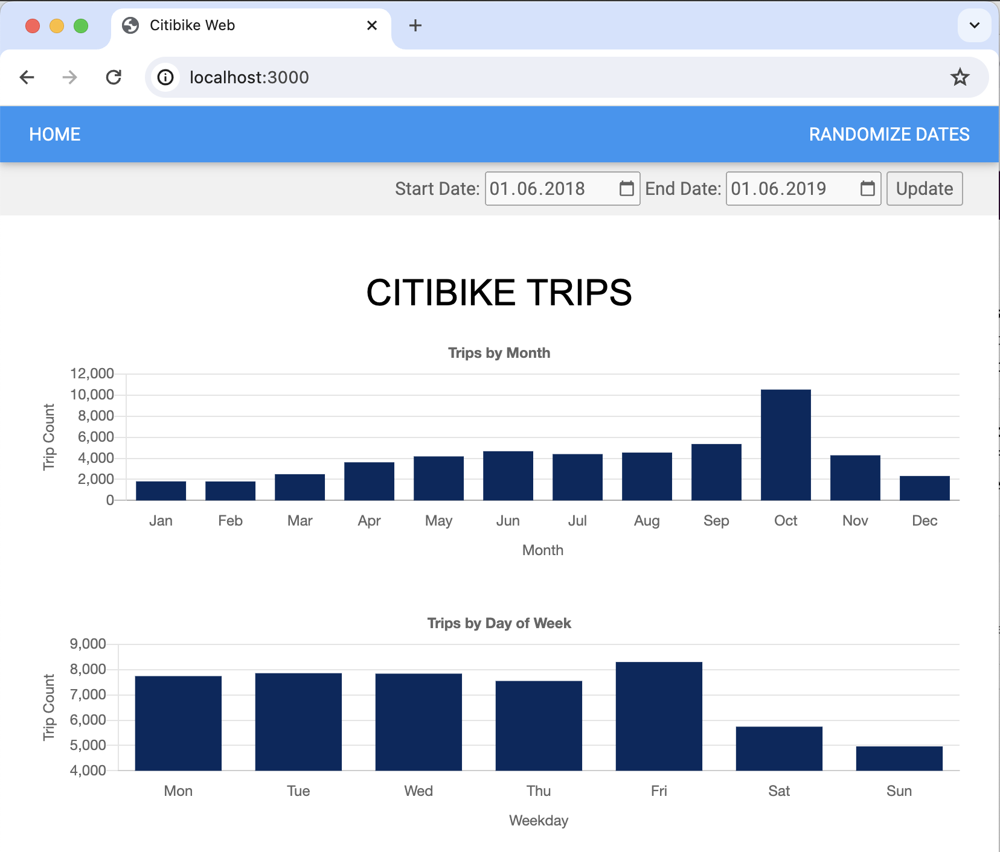

# Running Data Application workloads in LocalStack Snowflake

Note: This sample application has been copied and adapted from its original version here: https://github.com/Snowflake-Labs/sfguide-data-apps-demo

## Overview

The demo features a single-page web application (powered by Node.js) displaying several charts. The chart data is sourced from Snowflake using Citibike data. The web server backend connects to the LocalStack Snowflake emulation running locally via the Node.js Snowflake SDK.

## Prerequisites

- [`localstack` CLI](https://docs.localstack.cloud/getting-started/installation/#localstack-cli) with [`LOCALSTACK_AUTH_TOKEN`](https://docs.localstack.cloud/getting-started/auth-token/) environment variable set
- [LocalStack Snowflake emulator](https://snowflake.localstack.cloud/getting-started/installation/)
- [Snowflake CLI](https://github.com/snowflakedb/snowflake-cli) with a `local` profile configured (more details below)
- Node.js & `npm` installed

## Instructions

The sample application provides Makefile targets to simplify the setup process. You can run the following commands to start the LocalStack Snowflake emulator, seed the Citibike data, and start the web server:

```bash
make start
make install
make seed # Requires a local Snowflake CLI profile named 'local' (see below for instructions)
make web-start
```

You can follow the instructions below to run the application manually.

### Start LocalStack

Start the LocalStack Snowflake emulator using the following command:

```bash
DOCKER_FLAGS='-e DNS_NAME_PATTERNS_TO_RESOLVE_UPSTREAM=demo-citibike-data.s3.amazonaws.com -e SF_LOG=trace -e SF_CSV_IMPORT_MAX_ROWS=20000' \
IMAGE_NAME=localstack/snowflake \
DEBUG=1 \
localstack start
```

In the above command, we set the `DNS_NAME_PATTERNS_TO_RESOLVE_UPSTREAM` environment variable to resolve the `demo-citibike-data.s3.amazonaws.com` domain to the real S3 service, in order to download the Citibike data. We also set the `SF_CSV_IMPORT_MAX_ROWS` to `20000` to limit the number of rows imported from the CSV file (for testing purposes).

### Install the dependencies

Run the following command to install the dependencies:

```bash
npm install
```

### Configure Snowflake CLI

To seed the Citibike data into Snowflake, you need to configure the Snowflake CLI with a `local` profile. You can use the following command to create a new profile:

```bash
snow connection add \
    --connection-name local \
    --user test \
    --password test \
    --account test \
    --host snowflake.localhost.localstack.cloud
```

To test the connection, you can run the following command:

```bash
snow connection test --connection local
```

### Seed the Citibike data

Run the following command to seed the Citibike data into Snowflake:

```bash
snow sql -c local --query "create stage demo_data url='s3://demo-citibike-data'"
snow sql -c local --query 'create or replace table trips(tripduration integer,starttime timestamp,stoptime timestamp,start_station_id integer,end_station_id integer,bikeid integer,usertype string,birth_year integer,gender integer);'
snow sql -c local --query 'copy into trips from @demo_data file_format=(type=csv skip_header=1) PATTERN = '"'"'trips__0_0_0.*csv.*'"'"
snow sql -c local --query 'create or replace table weather(STATE TEXT,OBSERVATION_DATE DATE,DAY_OF_YEAR NUMBER,TEMP_MIN_F NUMBER,TEMP_MAX_F NUMBER,TEMP_AVG_F NUMBER,TEMP_MIN_C FLOAT,TEMP_MAX_C FLOAT,TEMP_AVG_C FLOAT,TOT_PRECIP_IN NUMBER,TOT_SNOWFALL_IN NUMBER,TOT_SNOWDEPTH_IN NUMBER,TOT_PRECIP_MM NUMBER,TOT_SNOWFALL_MM NUMBER,TOT_SNOWDEPTH_MM NUMBER);'
snow sql -c local --query 'copy into weather from @demo_data file_format=(type=csv skip_header=1) PATTERN = '"'"'weather__0_2_0.*csv.*'"'"
```

### Start the web server

Start the web server using the following command:

```bash
npm start
```

You can now access the web application at http://localhost:3000.



## Troubleshooting

In case you're not able to access the web application, you can add the following entry to your `/etc/hosts` file:

```text
127.0.0.1       snowflake.localhost.localstack.cloud
127.0.0.1       localhost.localstack.cloud
```

This will allow the Snowflake CLI to resolve the `snowflake.localhost.localstack.cloud` domain to the LocalStack Snowflake emulator.

## License

This sample application is published under the Apache 2.0 License (see [`LICENSE`](../LICENSE) file).
