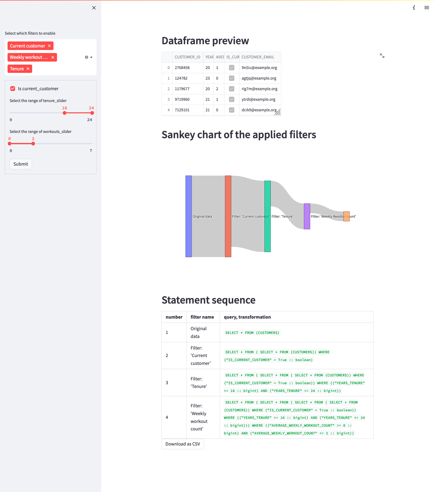

# Streamlit Data Filters Application in LocalStack Snowflake

Note: This sample application has been copied and adapted from its original version here: https://github.com/Snowflake-Labs/streamlit-examples/tree/main/Dynamic%20Filters%20Snowpark

## About this sample

This is a Streamlit demo that showcases how filters can be generated.

The app connects to Snowflake and retrieves the data using snowpark Python, pushing the computations into a Snowflake warehouse.



## App features

* Dynamically selectable list of filters ("Select which filters to enable")
* Result preview
* Sankey chart showing the effects of selected filters
* Statement sequence showing which SQL statements are performed to get the result
* Download button to get the csv file with results

# Setup

To run the app, following steps are required:

## Prerequisites

- [`localstack` CLI](https://docs.localstack.cloud/getting-started/installation/#localstack-cli) with [`LOCALSTACK_AUTH_TOKEN`](https://docs.localstack.cloud/getting-started/auth-token/) environment variable set
- [LocalStack Snowflake emulator](https://snowflake.localstack.cloud/getting-started/installation/)
- [Snowpark for Python](https://docs.snowflake.com/en/developer-guide/snowpark/python/index)
- [Streamlit CLI](https://github.com/streamlit/streamlit)

Note: Snowpark requires python 3.8.*, please ensure that you have that version available in your environment.

### Poetry

The project is using [poetry](https://python-poetry.org/) to manage the dependencies and local CI.

To set up the project:

1. [Install poetry](https://python-poetry.org/docs/#installation)
2. Open the project directory in a terminal emulator
3. (optional) to force the use of python 3.8, run `poetry env use /path/to/python3.8`
4. Run `poetry install` to install dependencies into project-specific virtual environment

### pip

As an alternative to `poetry`, the project can also be set up via `pip`:

1. Create a python 3.8 virtual environment
2. Switch into the created virtual environment
3. Use provided `requirements.txt` to install the dependencies: `pip -r requirements.txt` 

## Streamlit connection details

To be able to connect to the LocalStack Slowflake emulator when developing locally
Streamlit provides a mechanism for storing secrets and connection details in the project
([doc link](https://docs.streamlit.io/streamlit-cloud/get-started/deploy-an-app/connect-to-data-sources/secrets-management#develop-locally-with-secrets))

To run the sample against LocalStack Snowflake, your local `~/.streamlit/secrets.toml` should look something like this:

```toml
[snowpark]
user = "test"
password = "test"
account = "test"
warehouse = "test"
database = "STREAMLIT_DEMO"
schema = "STREAMLIT_USER_PROFILER"
role = "test"
host = "snowflake.localhost.localstack.cloud"
```

## Data setup in LocalStack Snowflake

The project comes with a [SQL sheet](./.assets/setup.sql) to be run in the environment.

For example, if you have the [`snow` CLI](https://snowflake.localstack.cloud/user-guide/integrations/snow-cli/) configured with a `localstack` connection profile, the SQL script can be executed as follows:
```
snow sql -c localstack -f .assets/setup.sql
```

## Running the app

After performing the setup and switching to the virtual environment, you can run the application using:

`streamlit run main.py`

## License

This sample application is published under the Apache 2.0 License (see `LICENSE` file).
